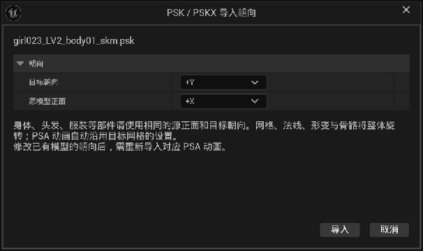
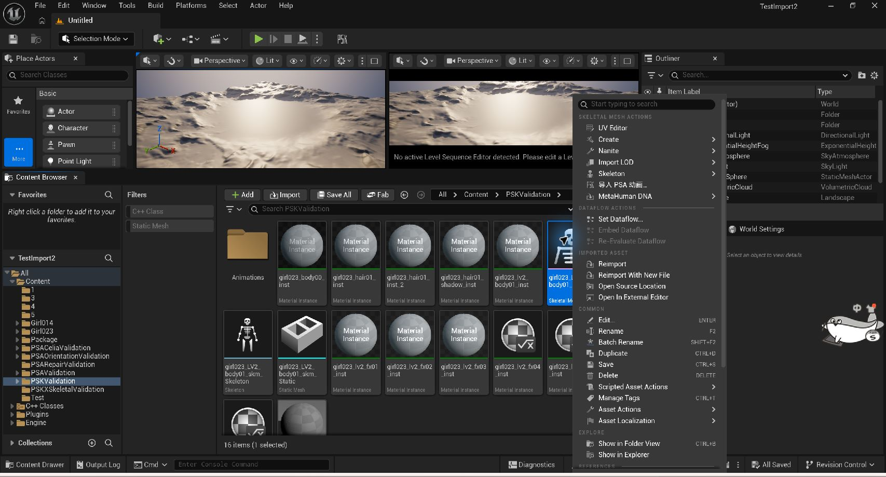
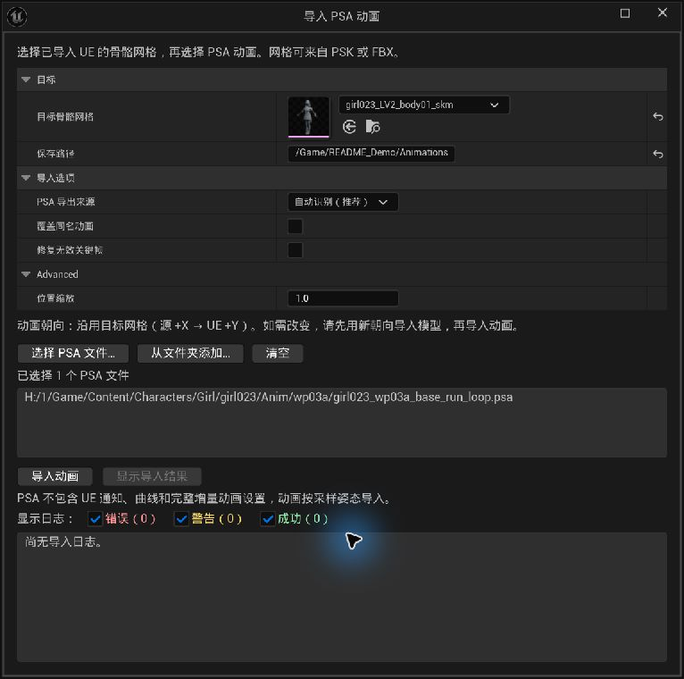
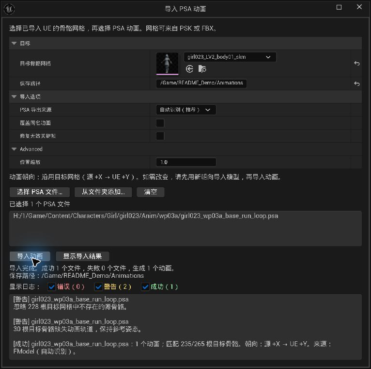

# Unreal PSK / PSKX / PSA Importer

**Import meshes and animations directly into Unreal Engine 5.8**

[简体中文](README.md) · **English**

[Install](#install) · [Import meshes](#import-meshes) · [Import animations](#import-animations) · [View results](#view-results)

---

Import **PSK / PSKX meshes** and **PSA animations**, with orientation options, invalid key repair, and log filters. Verified in the Windows / UE 5.8 editor.

## Install

1. Place the plugin in your project's `Plugins/UnrealPSKPSA` directory, with `UnrealPSKPSA.uplugin` inside.
2. Build the project's **Editor** target with the C++ toolchain required by UE 5.8. For a Blueprint-only project, first add a C++ class if needed.
3. Enable **Unreal PSK / PSKX / PSA Importer** under **Edit → Plugins**, and restart if prompted.

## Import meshes

1. Select a destination in the **Content Browser**, then click **Import** or drag in a `.psk` / `.pskx` file.
2. Choose Source forward and Target forward, then click **导入** (Import). The default is **source +X → UE +Y**; `+X / +Y / -X / -Y` are available.
3. Inspect the generated mesh. PSKX files containing skeletal data are imported as skeletal meshes.

  
   
  Use the same orientation settings for a character's body, head, and clothing.

> [!TIP]
> PSA animations inherit the mesh's saved import orientation. To change it, import the model again before importing animations.

## Import animations

### 1. Open the panel

Select one **Skeletal Mesh**, then right-click → **导入 PSA 动画…** (Import PSA Animation). The target mesh is filled in automatically. You can also use **Tools → 导入 PSA 动画…** or the plugin's toolbar icon.

  
   
  Right-click a skeletal mesh and choose Import PSA Animation. Click the image for full size.

### 2. Choose files and import

Confirm the target mesh and destination, and leave the source on **自动识别（推荐）** (Auto Detect). Use **选择 PSA 文件…** (Choose PSA Files) or **从文件夹添加…** (Add from Folder), then click **导入动画** (Import Animations).

  
   
  The panel supports multiple files and compatible target meshes imported from FBX. UI labels are currently Chinese.

| Common option / UI label | Usage |
| :--- | :--- |
| Destination / 保存路径 | Use a UE content path, such as `/Game/Characters/Animations` |
| Replace existing / 覆盖同名动画 | Off by default; only overwrites same-name animations using the same Skeleton |
| Repair invalid keys / 修复无效关键帧 | Off by default; interpolates interior gaps, copies the nearest valid key at either end, and fails if an entire bone track has no valid keys |

Add from Folder reads only the selected directory. Add subdirectories separately. Duplicate files are not added twice.

## View results

Check the success and failure counts after importing. Click **显示导入结果** (Show Imported Assets) to locate animations in the Content Browser. Toggle **错误 / 警告 / 成功** (Error / Warning / Success) independently to filter the log.

  
   
  A real import result: 1 animation created, with warnings for unmatched bones.

> [!IMPORTANT]
> Use the corresponding character's mesh and animations. Matching bone names alone do not guarantee compatibility; check the target mesh if importing fails. FBX or older meshes without this plugin's orientation metadata receive no additional orientation rotation.

---

Based on [h4lfheart/UnrealPSKPSA](https://github.com/h4lfheart/UnrealPSKPSA). Issues and Pull Requests are welcome. Include your UE version, export tool, and error log when reporting a problem.

[阅读简体中文版](README.md) · **English**

