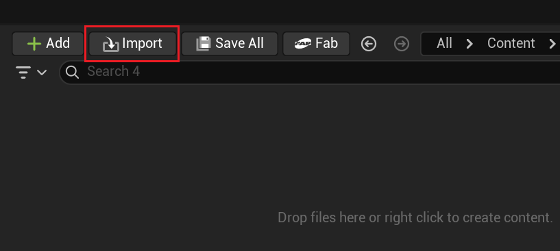
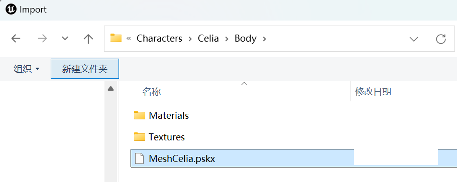
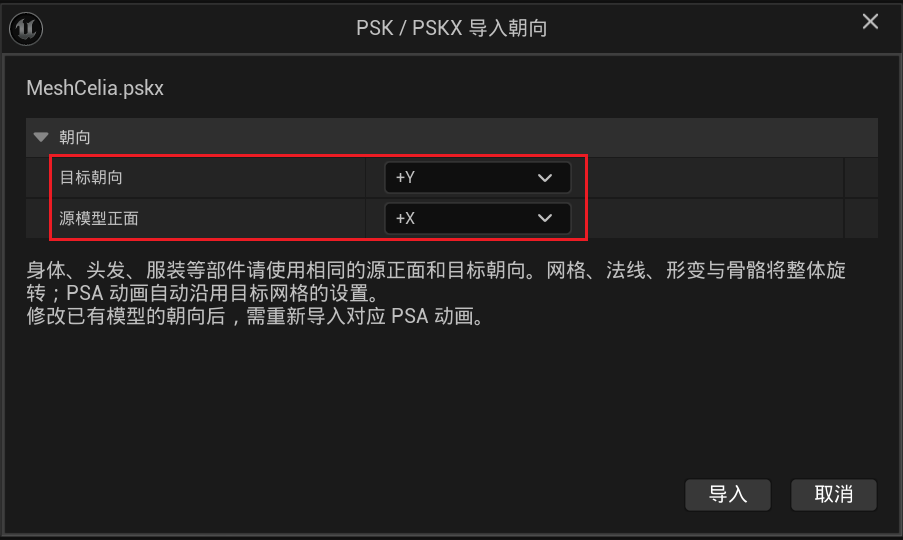
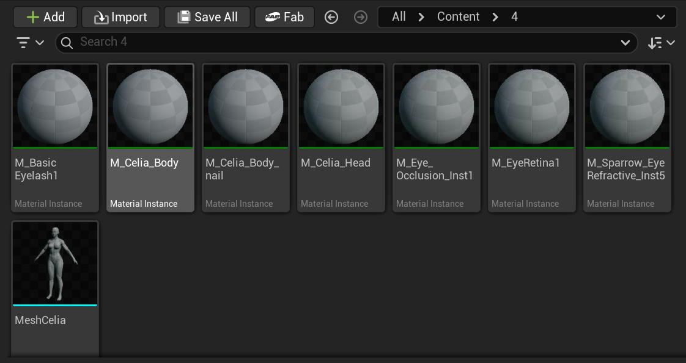
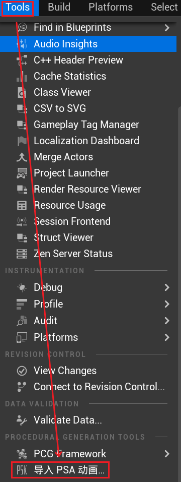
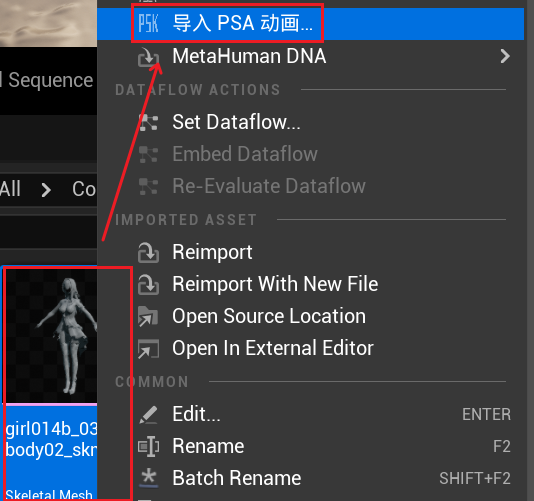
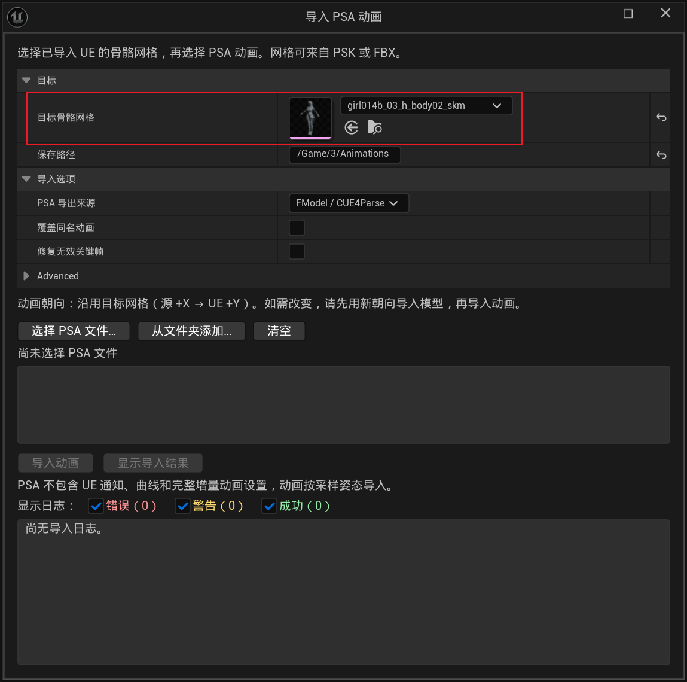
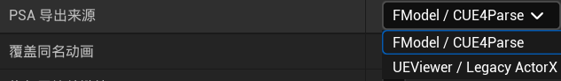

### 使用说明

---

##### 一. 背景介绍

- 参考如下项目修改完成，由于最近有对 **PSK / PSA** 文件的导入需求，而原来的项目存在 **Bug** 且无法导入 **PSA**，所以进行修改：

  https://github.com/h4lfheart/UnrealPSKPSA

---

##### 二. 使用方法

- **PSK / PSKX** 文件导入：

  1. 找到一个空文件夹（它会直接导入到当前文件夹下），选择 "**Import-> 选择要导入的 `.psk` ** " ： 

     

     选择要导入的 `.psk` 或 `.pskx` 文件：

     

  2. 然后会出现一个弹窗，此时需要选择朝向。因为 **PSK** 的文件朝向可能与导入 **UE** 需要的朝向并不一致，此时可以进行设置，无需在导入到 **DCC** 软件进行调整（这个选择可能需要你进行一定的尝试才能知道 :D ）：

     

  3. 这里是我导入的效果：

     

> Tip：可以直接【**拖拽**】PSK 文件到 Content 目录下即可进行导入。

---

- **PSA** 文件导入：

  1. **PSA** 文件的导入依赖于 **PSK / PSKX** 文件，即动作需要与模型进行匹配。其导入的入口有如下三处：

     ① 通过 "**Tool -> 导入 PSA 动画...**"：

     

     ② 直接在工具栏上可以看到按钮：

     

     ③ 通过点击骨骼网格体，"**右键菜单 -> 导入 PSA 动画...**"：

     

  2. 点击 "**导入 PSA 动画...**" 会打开一个弹窗，首先需要对模型进行指定，如果是右键的方式打开的，那么会自动进行选定：

     

     - **保存路径**：就是导入的 `.psa` 文件的保存路径，以 "**/Game**" 即 **Conent**目录为开头；

     - **PSA 导出来源**：一般 **FModel** 就使用 **FModel / CUE4Parse**：

       

     - **覆盖同名动画**：如果导出的文件夹出现于导出内容同名的文件，那么这里会设置是否覆盖；

     - **修复无效关键帧**：可能存在某些帧是空的，那么会采用如下的方式进行处理：如果存在前后帧，那么该帧通过前后帧差值得到；如果只有前帧或者只有后帧，那么这一帧会复制为前帧或后帧；如果都没有，那么就会失败；

     - **位置缩放**：如果模型与 UE 的单位不匹配，可以通过这个选项来进行单位的缩放，可以避免使用 **DCC**；

     - **动画导入**：可以使用 "**选择 PSA 文件...**" 进行单个动画文件的导入，也可使用 "**从文件夹添加...**" 来进行批量处理。在导入之后，会在下面第一个款内看到要导入的文件，可以手动删除或者按 "**清空**" 来进行删除（它就是一个文本）。点击 "**导入动画**" 即可完成操作。通过点击 "**显示导入结果**" 可以打开本地的导出文件夹。

       > 备注：对于之前导入模型的时候进行了 "**旋转处理**" 的，这里直接导入即可，插件会自动处理旋转的事宜。

     - **日志**：对应的导入执行结果可以在下面的日志看到。通过勾选 "错误"、"警告" 和 "成功" 可以看到对应级别的日志。一般来说，补帧、缺失骨骼轨道、取消导入等提示归入警告，导入失败归入错误。

---

##### 三. 关于维护

- 如果有问题，请提交相关的 **PR**。
- 目前使用的是 **UE 5.8** 的版本，之前的程序好像只支持到 **UE 5.2**，然后这些版本之间的 **API** 并不太一样，所以有点不想维护之前空缺的 **UE** 版本了。

- 插件属于免费开源插件，请遵原 **UnrealPSKPSA** 的许可使用即可。

---

 